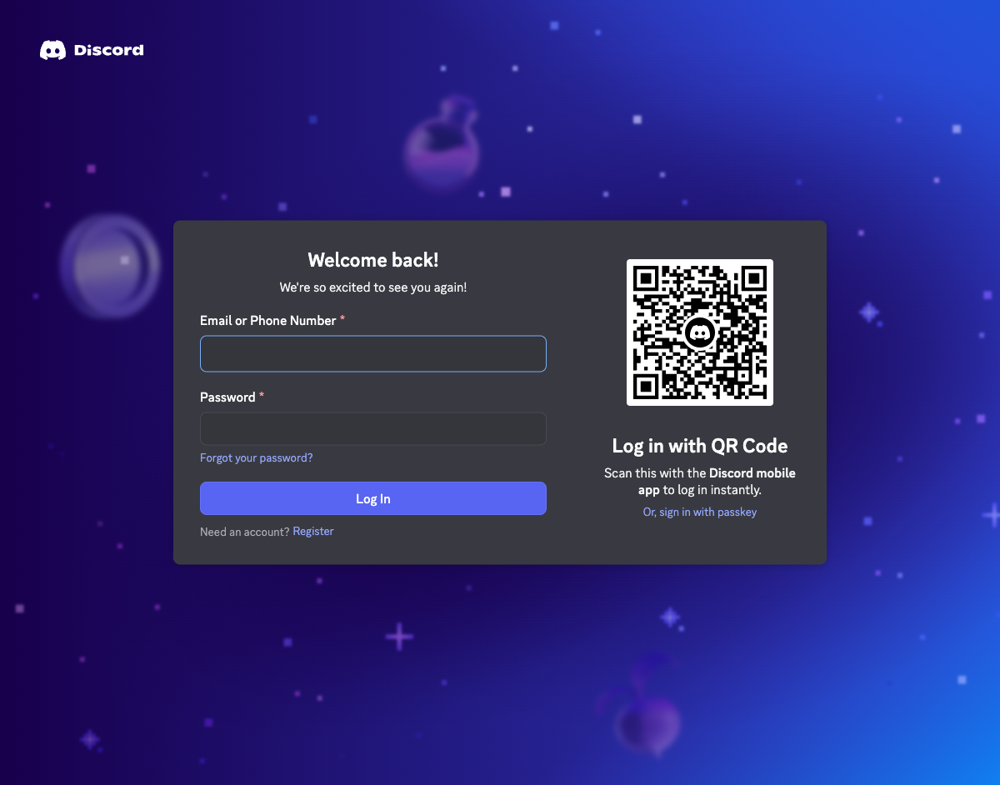

# Discord 스모크 테스트 기록

날짜: 2026-03-23

## 목표

아래 5개 실제 Discord 흐름을 테스트 서버에서 수동 검증하려고 시도했다.

1. `spy -> mafia 적중 -> bonus inspect UI/DM`
2. `reporter 기사 준비 -> publish 버튼 -> 공개 메시지`
3. `밤/낮 전환 시 mafia/lover/graveyard 채널 권한 변화`
4. `madam seduction -> politician trial 처리`
5. `contacted beastman only -> beastKill 프롬프트와 실제 처형`

## 실행 환경

- 로컬에서 `npm run dev` 실행
- 봇 로그인 확인 로그:

```text
logged in as 게임 봇#0635
```

## 시도 절차

1. 로컬에서 봇을 실행해 Discord에 로그인시켰다.
2. Playwright로 `https://discord.com/app` 에 접속해 테스트 서버 UI에서 직접 명령을 넣으려 했다.
3. Discord 웹앱이 저장된 사용자 세션을 찾지 못해 `https://discord.com/login` 으로 리다이렉트되었다.
4. 이메일/비밀번호 또는 QR 로그인 없이는 사용자 상호작용을 생성할 수 없어, 실제 길드 내 수동 플로우 검증을 진행하지 못했다.

## 실패 원인

- 현재 Codex 실행 환경에는 테스트 유저의 Discord 로그인 세션이 없다.
- 봇 토큰만으로는 슬래시 커맨드/버튼 클릭 같은 사용자 상호작용을 대신 만들 수 없다.

## 증적

스크린샷:


관찰 결과:

```text
Page URL: https://discord.com/login
Page Title: Discord
```

## 결론

- 봇 프로세스 자체는 정상 기동되었다.
- 하지만 실제 서버 수동 스모크 테스트는 테스트 유저 로그인 세션 부재로 블록되었다.
- 엔진 수정 후 로컬 검증은 별도로 `npm test`, `npm run build` 로 재확인했다.

## 다음 재시도 조건

- 테스트용 Discord 계정이 웹 클라이언트에 로그인된 상태
- 또는 사용자가 직접 로그인/QR 인증을 마친 뒤 같은 환경에서 재실행

## 재시도 2

영매/성직자 semantics를 `RULE.md` 기준으로 엔진, 역할 카드 설명, UI 예시, 테스트까지 통일한 뒤 동일한 5개 항목을 다시 수동 검증하려고 시도했다.

### 재실행 전 확인

- `npm test` 통과
- `npm run build` 통과
- `npm run dev` 실행 후 봇 로그인 재확인:

```text
logged in as 게임 봇#0635
```

### 재시도 결과

1. Playwright로 다시 `https://discord.com/app` 에 접속했다.
2. 약 5초 후 웹앱은 다시 `https://discord.com/login` 으로 리다이렉트되었다.
3. 따라서 아래 5개 수동 검증 항목은 이번 재시도에서도 실행하지 못했다.

- `spy -> mafia 적중 -> bonus inspect UI/DM`
- `reporter 기사 준비 -> publish 버튼 -> 공개 메시지`
- `밤/낮 전환 시 mafia/lover/graveyard 채널 권한 변화`
- `madam seduction -> politician trial 처리`
- `contacted beastman only -> beastKill 프롬프트와 실제 처형`

### 증적 추가

스크린샷:



관찰 결과:

```text
Page URL: https://discord.com/login
Page Title: Discord
```

### 상태

- 코드와 문서는 현재 `RULE.md` 기준으로 통일되었다.
- 실제 Discord 수동 스모크 테스트는 여전히 사용자 로그인 세션 부재가 유일한 블로커다.
